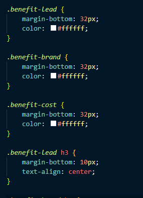

# horiseon-code-refactor

# https://asw-afk.github.io/horiseon-code-refactor/

# html
A clean up of the original code into semantic htmnl. 
There were no instances of tags other than div, making things bulky and unclear. 

# css 
The original included redunancy in the css id's and classes.

# An Example of the Original CSS

# An Example of the Updated CSS

# Completed Webpage
 

Original source code provided by UCF Instructors.
Located within the repo at the folder titled original under assets. 